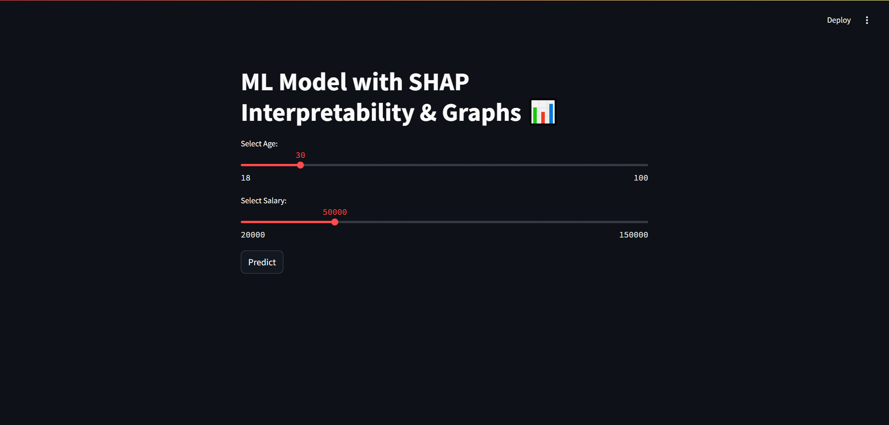
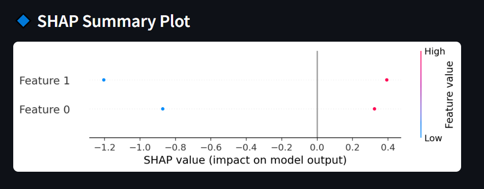
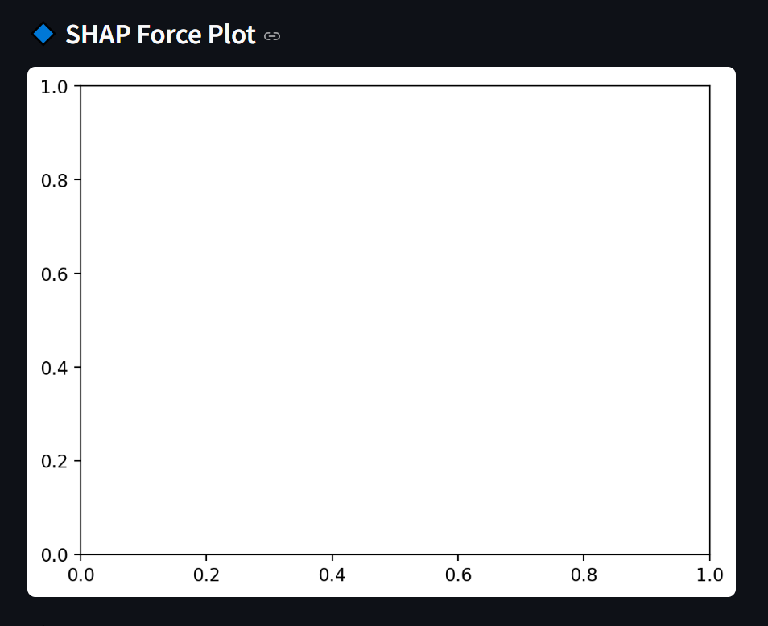
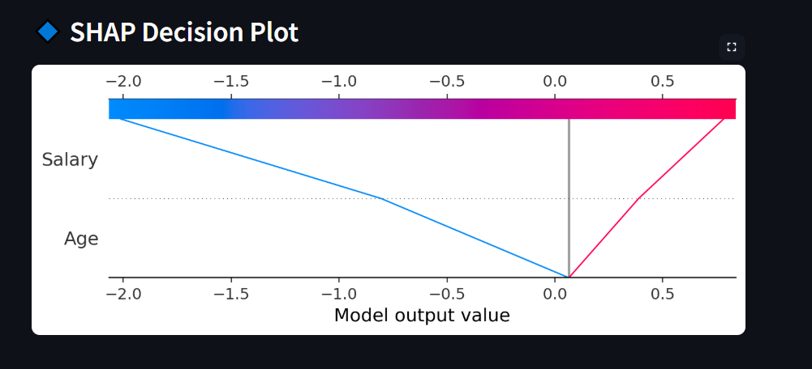

# 🧠 ML Model with SHAP Interpretation 📊

This is a **Streamlit** web app that predicts user behavior based on **Age & Salary**, using a **Logistic Regression model**. The app provides **SHAP-based visual explanations** to understand model predictions.

---

## 📌 Features  
✅ Interactive **Streamlit UI**  
✅ **Predict if a user will purchase**  
✅ **SHAP Summary Plot** – Feature importance  
✅ **SHAP Force Plot** – Individual prediction explanation  
✅ **SHAP Decision Plot** – Cumulative feature effect  
✅ **Graphical Visualizations** for clarity  

---

## 🚀 Demo Screenshots  

### 🔹 Streamlit UI  

### 🔹 SHAP Summary Plot  

### 🔹 SHAP Force Plot  

### 🔹 SHAP Decision Plot  

---

